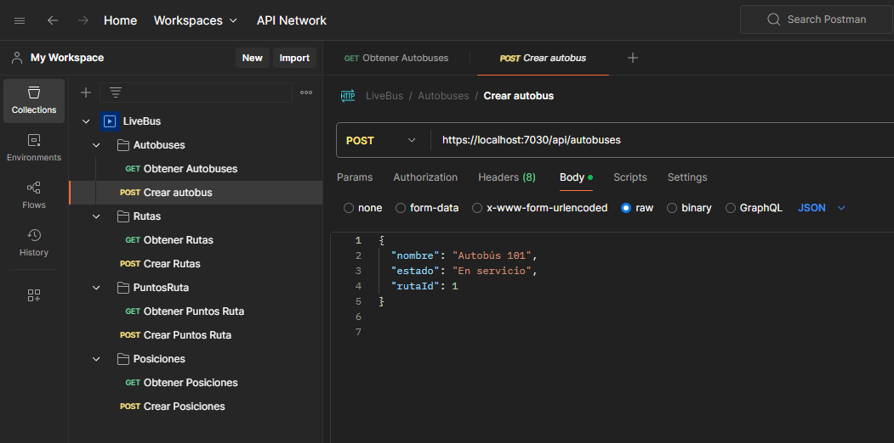
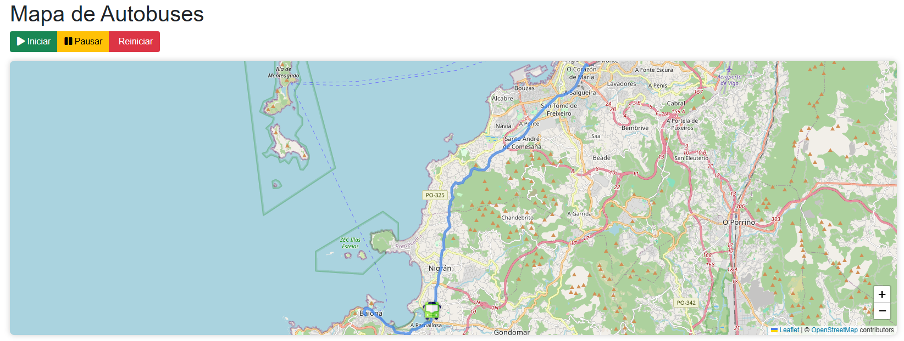
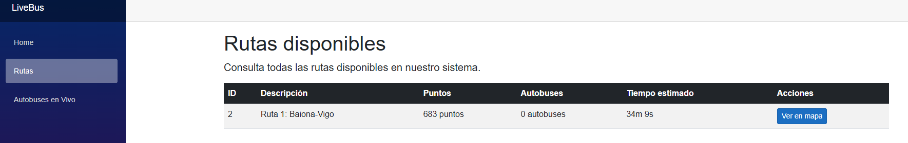
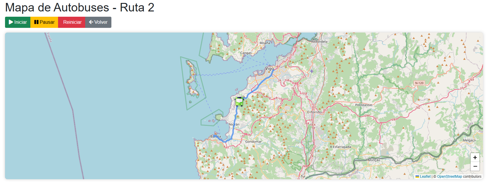

# LiveBus

## Bitácora de Desarrollo

### 18/03/2025

- Instalé todo lo necesario.
- Creé la base de datos y realicé las migraciones.
- Vi un video en YouTube para entender un poco Blazor, aunque aún no lo usaré ya que primero me encargaré del backend.

    [Video de YouTube](https://www.youtube.com/watch?v=VDkiB5F7FH0)

&nbsp;
--- 
&nbsp;

### 19/03/2025

- Empecé viendo un video que explica conceptos básicos de ASP.NET 

    [Video](https://www.youtube.com/watch?v=Gua0O0Q7I58) 


- Después vi otro video para aprender a crear APIs con esta tecnología 

    [Video](https://www.youtube.com/watch?v=IhzQUI6XHPw)

&nbsp;
- Luego, me puse a crear la API del proyecto y me di cuenta de que tenía que cambiar el diseño de las tablas de mi base de datos. Añadí una tabla adicional y, después de modificar los modelos, intenté hacer la migración, pero me daba error constantemente. Al final, después de un buen rato, probé a cerrar y volver a abrir el IDE y se solucionó.

- Lo siguiente que hice fue crear los Controladores usando Scaffolding, que automatiza la creación de los endpoints. Tuve que modificar el código generado para que se ajuste a las relaciones que tengo entre tablas.

- Finalmente, descargué PostMan y configuré mi entorno de trabajo. 

&nbsp;



---


### 20/03/2025

- Agregué las dependencias para Leaflet y SignalR.
- Modifiqué la tabla autobuses con un nuevo campo, PuntoActual.
- Creé un nuevo controlador para manejar las simulaciones y un hub de SignalR para enviar actualizaciones a los clientes.
- A modo de debug provisional, intenté hacer una página con un mapa para ir probando simulaciones, pero no he conseguido que aparezca el mapa.
- Para intentar que el mapa apareciese, probé a usar Leaflet con JavaScript y C#, pero no sirvió.

---

### 22/03/2025 - 23/03/2025

- Estos dos días intenté hacer que apareciese el mapa en /autobuses pero me encontré con los siguientes problemas:
  - Estaba haciendo el proyecto con una configuración errónea, es una web Blazor Server, no Blazor WebAssembly. Tuve que cambiar esto en **App.razor**
    
    ```html
    <script src="_framework/blazor.web.js"></script>  -->  <script src="_framework/blazor.server.js"></script>
    ```
  - El cliente al conectarse a la web era desconectado al instante, un problema difícil de ver ya que solo avisaba por la consola del navegador. Lo descubrí mientras arreglaba un fallo.
    - Para solucionar este error tuve que volver a un commit anterior del proyecto, ya que no era capaz de encontrar el error. Después de ir archivo por archivo descubrí que era producido por SignalR, tecnología que usaré más adelante para actualizar el mapa en tiempo real. De momento, la he quitado, lo solucionaré más adelante.
  - Haciendo pruebas en /autobuses me di cuenta de que el JavaScript no se ejecutaba. Puse puntos de depuración y no lanzaba la función que tenía adjunta al onClick del botón, el fallo resultó ser que para que un archivo razor detecte el onClick del botón necesita este parámetro al inicio del archivo:
    ```ruby
        @rendermode InteractiveServer
    ```

  
- Actualmente, en /autobuses el mapa carga una ubicación.

---

### 24/03/2025
  - Descubrí que si lanzo el servidor desde el Visual Studio y cuando entro a la página cierro el navegador, el servidor se cierra de manera abrupta. No conseguí saber el motivo, pero lo arreglé lanzando el servidor desde consola. 
  
  - Para agilizar el proceso de iniciar el servidor, hice un script:
  
    ```bash
        @echo off
        cd /d C:\Users\marco\source\repos\LiveBus\LiveBus
        start cmd /k dotnet run --urls="https://localhost:7030"
    ```

  - Creé el archivo **signalr-autobus.js**. Este archivo JavaScript crea un sistema para mostrar autobuses en movimiento sobre un mapa. Establece una conexión en tiempo real con el servidor usando SignalR que permite ver cómo se mueven los autobuses por sus rutas. El código inicializa un mapa interactivo, carga las rutas y posiciones iniciales de los autobuses desde la API, y actualiza sus posiciones con animaciones suaves cuando se reciben nuevas coordenadas. Los autobuses aparecen como marcadores personalizados en el mapa, las rutas se dibujan como líneas de colores, y el usuario puede ver información adicional al hacer clic sobre ellos. También incluye funciones para controlar la simulación (iniciar, pausar y reiniciar) mediante llamadas a la API correspondiente.
  
  - Eliminé **leaflet-init.js** ya que la inicialización del mapa la añadí a **signalr-autobus.js**.

  - Creé la carpeta Hubs y dentro el archivo **AutobusHub.cs**. Este archivo permite comunicación en tiempo real para la aplicación de autobuses. Funciona como un canal central que conecta el servidor con todos los clientes conectados, permitiéndoles recibir actualizaciones instantáneas. 

  - Creé la carpeta Servicios y dentro el archivo **SimulacionService.cs**. Es un servicio en segundo plano que gestiona el movimiento de autobuses a lo largo de rutas predefinidas. A intervalos regulares de 6 segundos, carga los autobuses y sus rutas desde la base de datos y los mantiene en memoria para procesar sus movimientos. Cada vez que se actualiza un autobús, envía notificaciones en tiempo real a todos los clientes conectados.
  
  - Creé el archivo **SimulacionController.cs**. Tiene tres acciones principales mediante peticiones POST: iniciar la simulación, pausarla y reiniciarla.

  &nbsp;

  - Funcionamiento actual del mapa:
    
     


  ---

  ### 25/03/2025

  - Puse un icono para el movimiento del autobus en el mapa. Ya no es una bola azul, ahora es esta imagen:
  
    

  ---

  ### 26/03/2025

  - He arreglado la manera en la que se registraban los valores del campo Timestamp en la tabla **Posiciones**. Se estaban guardando en una franja horaria diferente a la española. 
  - Eliminé la ruta existente.
  - Creé la primera ruta real, Baiona-Vigo:
    - Para hacer los puntos por los que se moverá el autobús, hacerlos a mano no era una opción ya que llevaría una cantidad de tiempo inmensa. Para agilizar el proceso usé una web que me permite trazar una ruta en el mapa y luego descargar un archivo **.gpx** que contiene todas las longitudes y latitudes de la ruta. Para convertir el archivo **.gpx** a **JSON** y añadir los puntos mediante la API use Chat GPT. Con un sencillo prompt pasándole el archivo extrajo los datos que me interesaban para crear la ruta.
    

      [Web para la ruta](https://graphhopper.com/maps/?profile=car&layer=Omniscale)
      
      Primer punto de la ruta:

      ```json
      {
          "RutaId": 2,
          "Orden": 1,
          "Latitud": 42.118657,
          "Longitud": -8.85353
      }
      ``` 
      Último punto de la ruta:
      
      ```json
      {
          "RutaId": 2,
          "Orden": 683,
          "Latitud": 42.234455,
          "Longitud": -8.714938
      }
      ``` 

      Gracias a esto, me he ahorrado crear manualmente 683 puntos en el mapa.

      Inconvenientes de este método:
      - En puntos donde la ruta no varía demasiado, como una recta, avanza más distancia de un movimiento.
      - En puntos donde la ruta varía mucho, como rotondas, avanza más lentamente.

      Soluciones a estos problemas:
      - Añadir o quitar puntos manualmente, lo cual haré una vez tenga el proyecto casi terminado.
    
  &nbsp;
  - Estado actual del mapa:

    &nbsp;

    

  ---

  ### 27/03/2025

  - He hecho cambios en la UI:
    - Cambios en Home. De momento queda así, en un futuro lo dejaré más vistoso.
    - He eliminado las páginas que trae Blazor por defecto.
    - He añadido la página **Rutas** donde habrá una tabla con las rutas de los autobuses. Así está actualmente:
    
    &nbsp;

    

    &nbsp;

    - Los campos de la tabla son aún provisionales. 
    - Puntos es el total de movimientos que hace el autobús para desplazarse por el mapa, con eso voy a calcular el tiempo en el campo Tiempo estimado. De momento no funciona.
    - En el botón se podrá ver en el mapa la posición del autobús. De momento no funciona.

  ---

  ### 05/04/2025
      
  - He arreglado el campo **Tiempo estimado**.
  
  ---

  ### 11/04/2025

  - Ahora el boton de la tabla funciona y te lleva a una vista donde solo ves el autobus seleccionado.
  
  
